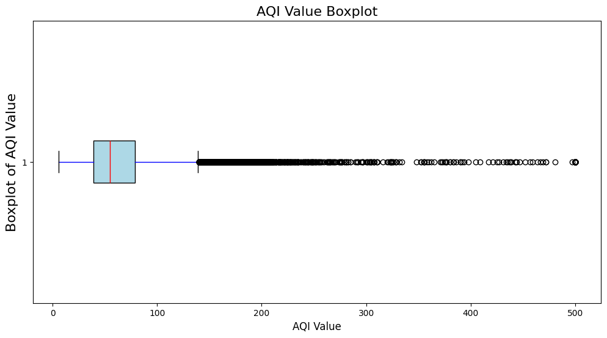
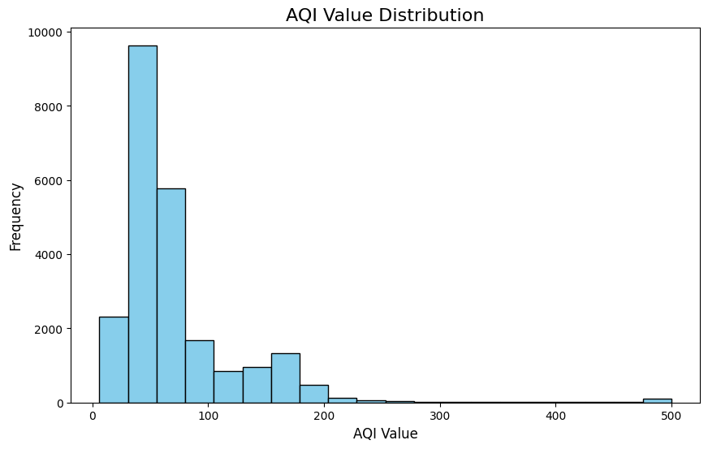
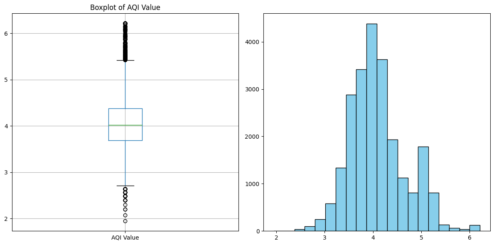
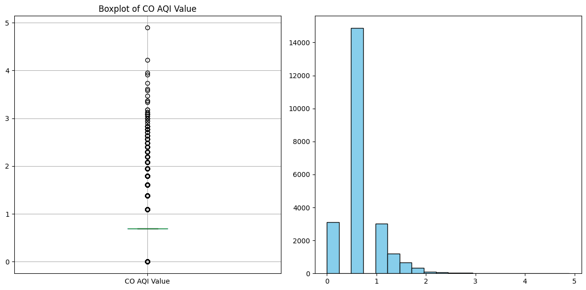
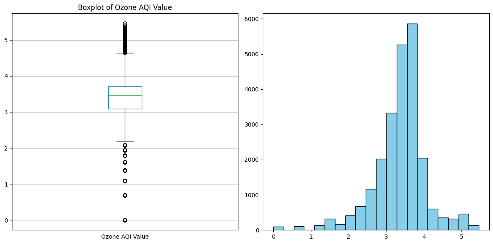
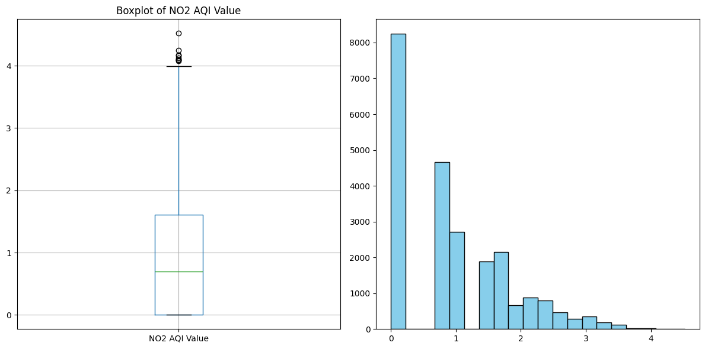
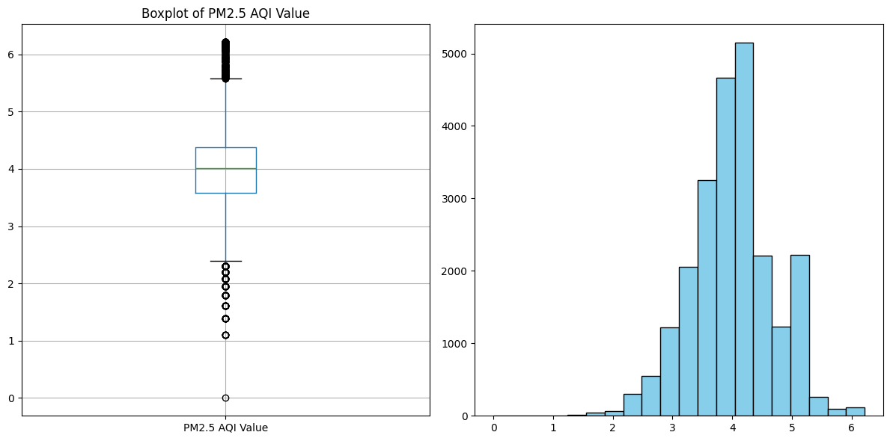

<a href="https://git.io/typing-svg"></a>
<p><b>На этой странице будут выкладываться лабораторные работы по дисциплине ИТиП</b></p>
<h1>Лобараторная работа №1</h1>
<ul>
  <li><a>Обзор данных</a></li>
  <li><a href="#Visual_Data">Предобработка и визуализация данных</a></li>
</ul>
<p>Первая часть задания:</p>
<ol>
  <li><p> Импортируйте библиотеку pandas</p></li>
  <li><p> Импортируйте библиотеку matplotlib.pyplot as plt</p></li>
  <li><p> Импортируйте библиотеку Numpy</p></li>
  <li><p> Прочитайте файл и сохраните его в любой переменной</p></li>
  <li><p> Выведите на экран первые 10 строк таблицы</p></li>
  <li><p> Одной командой выведите информацию о таблице</p></li>
  <li><p> Выведите типы данных по датасету одной командой</p></li>
  <li><p> Выведите количество строк и колонок одной командой</p></li>
  <li><p> Выведите на экран название колонок.</p></li>
  <li><p> С помощью isna посмотрите есть ли пропущенные значения, выведите количество по каждой колонке</p></li>
  <li><p> Проверьте данные на наличие дубликатов. Если есть дубликаты, удалите их.
Какой тип данных доминирует в датасете? Есть ли пропущенные значения и если да, то в каких колонках? </p></li>
</ol>
<p>Вторая часть задания:</p>
<ol>
  <li><p> Постройте диаграмму размаха для переменной data, подберите оптимальные параметры figsize. Наблюдаете ли Вы какие-то аномалии?</p></li>
  <li><p> Нарисуйте гистограмму для переменной data. Подберите оптимальные значения параметров bins и figsize. Выедите гистограмму с помощью команды plt.show.</p></li>
  <li><p> С помощью команды data.select_dtypes выберите все данные которые относятся к числовым (обращение к технической документации)</p></li>
  <li><p> С помощью лямбда функции проведите логарифмирование числовых данных, при логорифмировании прибавьте единицу.</p></li>
  <li><p> C помощью конструкции 
for values in data_log:
    data.boxplot(column=values)….постройте диаграммы размаха и гистограммы для отлогарифмированных значений.</p></li>
</ol>
<h2 id="Data">Обзор данных</h2>
<h3>Выполнение заданий 1 - 5</h3>

```python
    import pandas as pd # Импорт библиотек. Задание 1
    import matplotlib.pyplot as plt # Импорт библиотек Задание 2
    import numpy as np # Импорт библиотек Задание 3
    
    data = pd.read_csv('Airpollution.csv') # Чтение данных. Задание 4
    result = data.head(10) # Запись первых 10-ти ячеек
    print ("First 10 row:")
    print (result) # Вывод данных. Задание 5
```
<p>Вывод программы:</p>

```
First 10 row:
                    Country              City  AQI Value  \
0        Russian Federation        Praskoveya         51   
1                    Brazil  Presidente Dutra         41   
2                     Italy   Priolo Gargallo         66   
3                    Poland         Przasnysz         34   
4                    France          Punaauia         22   
5  United States of America       Punta Gorda         54   
6                   Germany        Puttlingen         62   
7                   Belgium             Puurs         64   
8        Russian Federation        Pyatigorsk         54   
9                     Egypt            Qalyub        142   

                     AQI Category  CO AQI Value CO AQI Category  \
0                        Moderate             1            Good   
1                            Good             1            Good   
2                        Moderate             1            Good   
3                            Good             1            Good   
4                            Good             0            Good   
5                        Moderate             1            Good   
6                        Moderate             1            Good   
7                        Moderate             1            Good   
8                        Moderate             1            Good   
9  Unhealthy for Sensitive Groups             3            Good   
...
6               62                        Moderate  
7               64                        Moderate  
8               54                        Moderate  
9              142  Unhealthy for Sensitive Groups
```
<h3>Выполнение заданий 6 - 9</h3>

```python
import pandas as pd # Импорт библиотек
import matplotlib.pyplot as plt # Импорт библиотек
import numpy as np # Импорт библиотек

data = pd.read_csv('Airpollution.csv') # Чтение данных
print ("Base info:")
data.info() # Вывод информации по таблице. Задание 6
print ("Type info:")
print (data.dtypes) # Вывод информации о типе данных. Задание 7
print ("Len info:")
print (data.shape) # Вывод информации о кол-ве стор и колонок. Задание 8
print ("Colums info:")
print (data.columns.values) # Вывод названий колонок. Задание 9
```
<p>Вывод программы:</p>

```
Base info:
<class 'pandas.DataFrame'>
RangeIndex: 23463 entries, 0 to 23462
Data columns (total 12 columns):
 #   Column              Non-Null Count  Dtype 
---  ------              --------------  ----- 
 0   Country             23036 non-null  object
 1   City                23462 non-null  object
 2   AQI Value           23463 non-null  int64 
 3   AQI Category        23463 non-null  object
 4   CO AQI Value        23463 non-null  int64 
 5   CO AQI Category     23463 non-null  object
 6   Ozone AQI Value     23463 non-null  int64 
 7   Ozone AQI Category  23463 non-null  object
 8   NO2 AQI Value       23463 non-null  int64 
 9   NO2 AQI Category    23463 non-null  object
 10  PM2.5 AQI Value     23463 non-null  int64 
 11  PM2.5 AQI Category  23463 non-null  object
dtypes: int64(5), object(7)
memory usage: 2.1+ MB
Type info:
Country               object
City                  object
AQI Value              int64
AQI Category          object
...
Colums info:
['Country' 'City' 'AQI Value' 'AQI Category' 'CO AQI Value'
 'CO AQI Category' 'Ozone AQI Value' 'Ozone AQI Category' 'NO2 AQI Value'
 'NO2 AQI Category' 'PM2.5 AQI Value' 'PM2.5 AQI Category']
```
<h3>Выполнение заданий 10 - 11</h3>

```python
import pandas as pd # Импорт библиотек
import matplotlib.pyplot as plt # Импорт библиотек
import numpy as np # Импорт библиотек

data = pd.read_csv('Airpollution.csv') # Чтение данных
missing_value_count = data.isna().sum() # Запись пропущенных значений в каждом столбце. Задание 10

print ("Missing value count:")
print (missing_value_count)
print ("Duplicated value count:")
print (data.duplicated())
new_data = data.drop_duplicates()

print ("After drop duplicates:")
print (new_data.duplicated())
```
<p>Вывод программы:</p>

```
Missing value count:
Country               427
City                    1
AQI Value               0
AQI Category            0
CO AQI Value            0
CO AQI Category         0
Ozone AQI Value         0
Ozone AQI Category      0
NO2 AQI Value           0
NO2 AQI Category        0
PM2.5 AQI Value         0
PM2.5 AQI Category      0
dtype: int64
Duplicated value count:
0        False
1        False
2        False
3        False
4        False
         ...  
23458    False
23459    False
23460    False
23461    False
...
23460    False
23461    False
23462    False
Length: 23463, dtype: bool
```
**В датасете доминирует object. Это можно понять из вывода данных:**


```python
Data columns (total 12 columns):
 #   Column              Non-Null Count  Dtype 
---  ------              --------------  ----- 
 0   Country             23036 non-null  object
 1   City                23462 non-null  object
 2   AQI Value           23463 non-null  int64 
 3   AQI Category        23463 non-null  object
 4   CO AQI Value        23463 non-null  int64 
 5   CO AQI Category     23463 non-null  object
 6   Ozone AQI Value     23463 non-null  int64 
 7   Ozone AQI Category  23463 non-null  object
 8   NO2 AQI Value       23463 non-null  int64 
 9   NO2 AQI Category    23463 non-null  object
 10  PM2.5 AQI Value     23463 non-null  int64 
 11  PM2.5 AQI Category  23463 non-null  object
```

**Пропущенные значения были:**  
Country               427  
City                    1
<h2 id="Visual_Data">Предобработка и визуализация данных</h2>
<h3>Задание 1</h3>
Большое кол-во выбросов (аномалий), которые находятся за пределеами усов

```python
import pandas as pd # Импорт библиотек
import matplotlib.pyplot as plt # Импорт библиотек
import numpy as np # Импорт библиотек

data['AQI Value'] = pd.to_numeric(data['AQI Value'], errors='coerce') # Для отбора данных берем столбец AQI Value как показатель качества воздуха
plt.figure(figsize=(12, 6))

plt.boxplot(data['AQI Value'].dropna(), vert=False, patch_artist=True,
            boxprops=dict(facecolor='lightblue'), whiskerprops=dict(color='blue'), medianprops=dict(color='red')) # Построение "ящика с усами"

plt.title('AQI Value Boxplot', fontsize=16)
plt.xlabel('AQI Value', fontsize=12)
plt.ylabel('Boxplot of AQI Value', fontsize=16)

plt.show()
```
<p>Вывод программы:</p>

<h3>Задание 2</h3>
<p>Представлена гистограмма для переменной data</p>

```python
import pandas as pd # Импорт библиотек
import matplotlib.pyplot as plt # Импорт библиотек
import numpy as np # Импорт библиотек

data['AQI Value'] = pd.to_numeric(data['AQI Value'], errors='coerce') # Для отбора данных берем столбец AQI Value как показатель качества воздуха + заранее работаем над ошибками
plt.figure(figsize=(10, 6)) # Задаем размер
plt.hist(data['AQI Value'].dropna(), bins = 20, color='skyblue', edgecolor='black') # Отсекаем все Nan, задаем шаг в 20 bins и цвет

plt.title('AQI Value Distribution', fontsize=16)
plt.xlabel('AQI Value', fontsize=12)
plt.ylabel('Frequency', fontsize=12)

plt.show()
```
<p>Вывод программы:</p>

<h3>Задание 3</h3>
<p>С помощью документации удалось понять как работает эта выборка</p>

```python
import pandas as pd # Импорт библиотек
import matplotlib.pyplot as plt # Импорт библиотек
import numpy as np # Импорт библиотек

data = pd.read_csv('Airpollution.csv') # Чтение данных
data_number = data.select_dtypes(np.number) # выбор только числовых данных
data_number.head # вывод их на экран
```
<p>Вывод программы:</p>

```
<bound method NDFrame.head of        AQI Value  CO AQI Value  Ozone AQI Value  NO2 AQI Value  \
0             51             1               36              0   
1             41             1                5              1   
2             66             1               39              2   
3             34             1               34              0   
4             22             0               22              0   
...          ...           ...              ...            ...   
23458        184             3              154              2   
23459         50             1               20              5   
23460         50             1               22              1   
23461         71             1               44              2   
23462         70             1               38              0   

       PM2.5 AQI Value  
0                   51  
1                   41  
2                   66  
3                   20  
4                    6  
...                ...  
23458              184  
23459               50  
23460               50  
23461               71  
23462               70  

[23463 rows x 5 columns]>

```
<h3>Задание 4</h3>
<p>В документации я нашел метод .apply() <br> 
Он применяет мои изменения сразу ко всем значениям <br>
  
```python
data_log = data_number.apply(lambda x : np.log(x+1)) 
```
</p>

```python
import pandas as pd # Импорт библиотек
import matplotlib.pyplot as plt # Импорт библиотек
import numpy as np # Импорт библиотек

data = pd.read_csv('Airpollution.csv') # Чтение данных
data_number = data.select_dtypes(include = [np.number]) # выбор только числовых данных
data_log = data_number.apply(lambda x : np.log(x+1)) # Логарифмирование данных
print (data_log)
```
<p>Вывод программы:</p>

```
       AQI Value  CO AQI Value  Ozone AQI Value  NO2 AQI Value  \
0       3.951244      0.693147         3.610918       0.000000   
1       3.737670      0.693147         1.791759       0.693147   
2       4.204693      0.693147         3.688879       1.098612   
3       3.555348      0.693147         3.555348       0.000000   
4       3.135494      0.000000         3.135494       0.000000   
...          ...           ...              ...            ...   
23458   5.220356      1.386294         5.043425       1.098612   
23459   3.931826      0.693147         3.044522       1.791759   
23460   3.931826      0.693147         3.135494       0.693147   
23461   4.276666      0.693147         3.806662       1.098612   
23462   4.262680      0.693147         3.663562       0.000000   

       PM2.5 AQI Value  
0             3.951244  
1             3.737670  
2             4.204693  
3             3.044522  
4             1.945910  
...                ...  
23458         5.220356  
23459         3.931826  
23460         3.931826  
23461         4.276666  
23462         4.262680  

[23463 rows x 5 columns]
```
<h3>Задание 5</h3>
Исходное задание следующее: <br> 
C помощью конструкции  <br>

```python
for values in data_log:  
    data.boxplot(column=values)…  
```
постройте диаграммы размаха и гистограммы для отлогарифмированных значений. <br>

**Выполнение**  
Для начала я взял предыдущее решение c логарифмированием данных. А после уже начал анализ данных через цикл ```for```  <br>
Используя уже полученные знания осталось только вывести данные в нужном порядке и правильных пропорциях + в документации нашел информацию и сетке расположения графиков:  

```python
plt.subplot(1, 2, 1)
```

```python
import pandas as pd # Импорт библиотек
import matplotlib.pyplot as plt # Импорт библиотек
import numpy as np # Импорт библиотек

data = pd.read_csv('Airpollution.csv') # Чтение данных
data_number = data.select_dtypes(include = [np.number]) # выбор только числовых данных
data_log = data_number.apply(lambda x : np.log(x+1))

for values in data_log.columns:
    plt.figure(figsize=(12, 6))
    
    #Диаграмма размаха
    plt.subplot(1, 2, 1)
    data_log.boxplot(column=values)
    plt.title(f'Boxplot of {values}')
    
    #Гистограмма
    plt.subplot(1, 2, 2)
    plt.hist(data_log[values].dropna(), bins=20, color='skyblue', edgecolor='black')
    plt.tight_layout()
    plt.show()
```
<p>Вывод программы:</p>





